<picture>
  <source media="(prefers-color-scheme: dark)" srcset="assets/banner-dark.svg">
  <source media="(prefers-color-scheme: light)" srcset="assets/banner-light.svg">
  
</picture>

<h3 align="center">Most AI systems get built twice. The first time is the expensive one.</h3>

  <a href="https://inference.institute"><b>inference.institute</b></a>
  &nbsp;·&nbsp;
  <a href="https://inference.institute/capabilities">What we do</a>
  &nbsp;·&nbsp;
  <a href="https://inference.institute/research">Research</a>
  &nbsp;·&nbsp;
  <a href="mailto:hello@inference.institute">hello@inference.institute</a>

---

We are an independent enterprise AI architecture, governance and risk practice.

Organisations do not usually fail at AI because the model was wrong. They fail at
the seam — between the proof of concept and the platform, between the architecture
and the regulation, between what a team built and what a board is willing to sign.
We work at that seam. We find where AI actually pays, design the system that gets
it there, and produce the evidence that lets a CTO, a buyer and a regulator all
say yes to the same thing.

Then we hand it over. We do not resell platforms, we take no vendor commission,
and we never bid to build what we have just specified. You choose who builds it.

## The three disciplines

| | | |
|---|---|---|
| **Architecture** | The system, designed once | Discovery and scoping, solution design, architecture review, platform architecture |
| **Governance & Risk** | Permission to go live | Governance readiness and operating models, risk and impact assessment, evidence a regulator can follow |
| **Ongoing Advisory** | Authority on retainer | Decisions made and recorded, reviews attended, the governance kept running between programmes |

Every engagement is fixed in scope before it starts and ends in something written
down — a design, an assessment, a decision. Not a workshop and a warm feeling.

## Readiness, not compliance

We work to the EU AI Act, ISO/IEC 42001, the NIST AI Risk Management Framework and
UK sector guidance. We deliver readiness and alignment — formal interpretation of
any regulation stays with your legal counsel. Nobody in this field can certify you,
and anyone offering certainty is selling something they cannot deliver.

## What we publish

[**inference.institute/research**](https://inference.institute/research) carries what
we have worked out, published before it is billable. Articles on architecture,
governance, method and data, written for practitioners rather than for search
engines — the EU AI Act's real demand on a retrieval system, why an assessment that
can only say yes or no is not an assessment, why the dull regression comes before
the GPU.

No papers, no DOIs, no citation furniture. Thinking that came out of doing the work.

## Bring us the question

The problem, the architecture, or the regulatory question. A scoping call is thirty
minutes and produces a written summary, whether or not you go on to engage us —
including when we think there is no work.

  <a href="https://inference.institute/contact"><b>Book a call</b></a>
  &nbsp;·&nbsp;
  <a href="mailto:hello@inference.institute"><b>Email us</b></a>

---

  
    Inference Institute is the trading name of <b>Inference Inst Ltd</b>, registered in England and Wales, company number 16676252. 
    <a href="https://inference.institute/terms">Terms</a> ·
    <a href="https://inference.institute/privacy">Privacy</a> ·
    <a href="https://inference.institute/security">Security</a>
  

